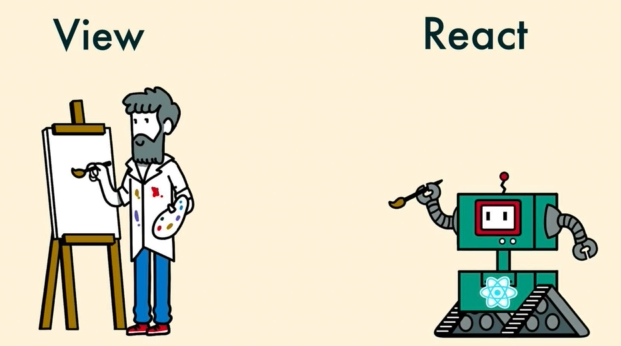

# 2. How React works
Created Tuesday 08 September 2020

* It efficiently renders the page by managing the virtual DOM, a JS object that mirrors the DOM.
* React will change the DOM in the most optimum way.

