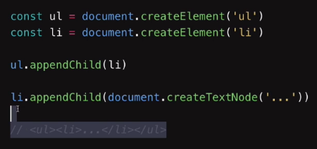
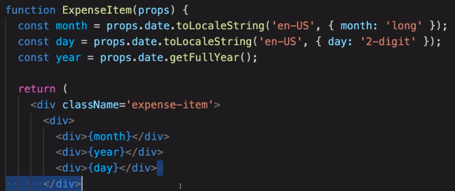

# 3. JSX
Created Thursday 27 August 2020

#### Why

* React uses a declarative approach to code UIs. JSX makes this easy.
* JSX also makes the code 
	* Intuitive and readable, instead of function calls.
	* Both structure and structure-related-logic are kept together.

Just imagine, the verbosity and unintuitiveness!

#### How
Handled by Babel transpiler.

#### What

* Short for JavaScript XML
* JSX is *not* necessary for using React, basic JS is fine too.
* JSX is a syntactic sugar for JavaScript, and so can be stored in variables.

**Rules for JSX**

0. Like HTML except if specified otherwise.
1. Some reserved keywords are different:
	* ``className`` instead of ``class`` attribute.
	* ``htmlFor`` in HTML label tag instead of ``for``.
2. JS **expressions** can be enclosed in braces {}. But avoid this, keep JSX lean - the logic outside JSX and result variable in JSX.

3. Components must start with a capital letter. 
4. JSX is an expression too, you can store it in variables or return it.

And [more](https://flaviocopes.com/jsx/) rules.

#### About JSX

* JSX prevents injection attacks - everything is converted into a string before being rendered.
* JSX represents objects.

