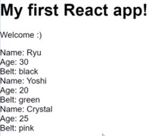

# 2. Rendering lists
Created Wednesday 09 September 2020

#### Why
React can render a hierarchied JSX object. But what about rendering **sibling** nodes.
React can render them too.

#### How
React render an array of JSX objects as sibling nodes.
Example
```JSX
return <div>{[<span> Hello </span>, <span> World </span>]}</div>
return <div>{names.map( (name) => <div>{name}</div> )} </div>} // commonly done
```

Note: React can render sibling nodes, but a single outermost container is still needed.
#### What
FIXME below from here
**How to output/render multiple components together on a page?**

* Doing a for loop won't help, as no object will be rendered finally.
* A simple way to do this: Have an array of **JSX objects** in a div. All items in the array will be rendered.
* We can create the array using **map** in JS


e.g Making a list of components and, then rendering it
```jsx
const ninjaList = ninjas.map( 
	ninja => (<div>
				<div>Name: {ninja.name} </div>
				<div>Age: {ninja.age} </div>
				<div>Belt: {ninja.belt} </div>
			</div>));
return (<div> {ninjaList} </div>);	// render function
```


* Alternatively, we could have directly written the JSX in the div.


*****

A note from React:

* As React does efficient manipulation of the DOM, it needs to know which component is what. This helps to check as to what components is removed, and what is still to be rendered.
* This is done using the **key** prop/attribute in the component. Just set it to some unique variable in the array, it can be an ID.
* An error shows if key is absent.

![[5._Rendering_lists/Pasted image 20220212185622.png]]

* To remove the error, add the key attribute to each component being rendered.

```jsx
const ninjaList = ninjas.map( 
	ninja => (<div key={ninja.id}>
				<div>Name: {ninja.name} </div>
				<div>Age: {ninja.age} </div>
				<div>Belt: {ninja.belt} </div>
			</div>));
return (<div> {ninjaList} </div>);	// render function
```
