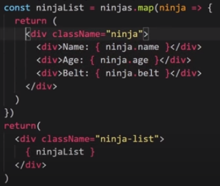
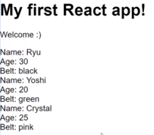
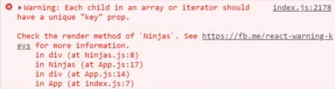
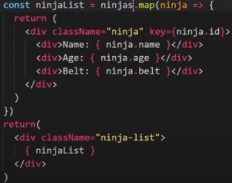

# 2. Outputting lists
Created Wednesday 09 September 2020

**How to output/render multiple components together on a page?**

* Doing a for loop won't help, as no object will be rendered finally.
* A simple way to do this: Have an array of **JSX objects** in a div. All items in the array will be rendered.
* We can create the array using **map** in JS

e.g Making a list, then keeping it in a div
	

* Alternatively, we could have directly written the JSX in the div.

*****

A note from React:

* As React does efficient manipulation of the DOM, it needs to know which component is what. This helps to check as to what components is removed, and what is still to be rendered.
* This is done using the **key** prop/attribute in the component. Just set it to some unique variable in the array, it can be an ID.
* An error shows if key is absent.

* To remove the error, add the key attribute to the component being rendered.

