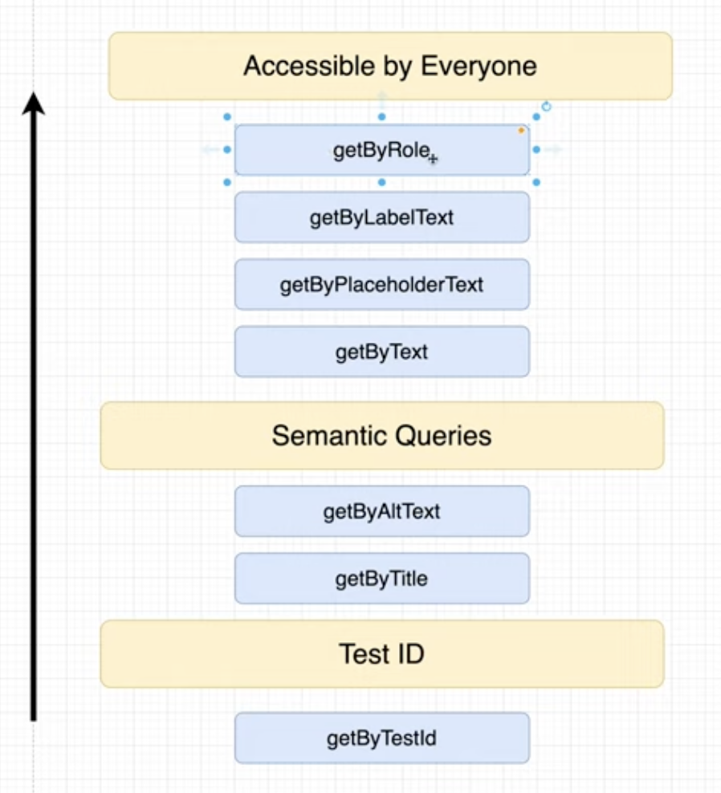

# 6. Locator priority

Locator just means the postfix, i.e. attribute part of a query method. Example `getByText` or `getByPlaceholderText`.

### Why
There are multiple locators that can be used to find the element we're interested in.

But we should strive to mimick user flow, i.e. we should be as specific as possible in selecting locators.

In short, specificity is similar to priority.

##### Locator priorities
There are 3.

1. `byRole` - locate type of tag - i.e. is a `heading`, or `button` etc.
2. `byLabelText` - for form labels
3. `byPlaceholderText`
4. `byText` - the most generic but of sufficient high priority.

If these are not useful, then use the Semantic queries or testID, because users will never see (i.e. usually) these.