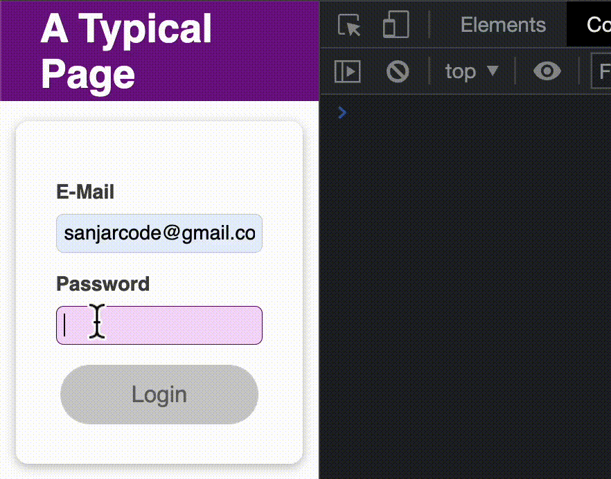

# 114. useEffect cleanup function
Created Tuesday 08 March 2022
- [x] in vault

### Why
Situation: The useEffect function may create eventListeners, or timeouts. Of course, we want only the latest ones, to avoid a cascading effect from old eventListeners, timeouts.

To do this 'cleanup', some cleanup code can be associated with `useEffect`, that runs **before** every `useEffect` function call, except the first execution (after 1st render).

This "cleanup" function can be specified as a callback from the function in `useEffect`.

### How
The cleanup function is run:
1. After each `useEffect` function execution.
2. Except the first `useEffect` function execution. Here, the cleanup is not run before.
3. After the component has been unmounted from the DOM.

So for `n` re-renders, the:
- `useEffect` runs 1 (on first render) + `n` times.
- The cleanup runs `n` + 1 (1 after unmount) times.

### What
The cleanup function is meant to just have logic to avoid a cascading effect of the side-effect, as pointed out earlier.

#### Example of cleanup function
Suppose we have a text `input` field, and we wish to check if the text exists in the backend or not. We will use `useEffect`, because sending an HTTP request is a "side-effect". This is functionally OK. But if we do this on every `onChange` of the field, it will be a lot of backend requests.

To avoid this, we can actually wait for some time after the user has stopped (finished) typing in the text field. So we use a `setTimeout` in the `onChange` function. This will create a timeout before sending the HTTP request.

But again, as the `setTimeout` is set for each keystroke, but never removed, we'll have a cascading (repeating) effect from the enqueued `setTimeout`s. The solution is to remove the timeouts after each render, and set a new Timeout. This is perfect for the `useEffect`, as the cleanup is run before the `useEffect` function runs. The code would look something like this:
```jsx
import {useEffect} from 'react';

function MyComponent() {
	...
	useEffect(() => {
		const timeoutVar = setTimeout(
			() => {
				... // check HTTP request and validate
			};

		return (() => { // cleanup function
			clearTimeout(timeOutVar);
		})
			, 400);
	}, [enteredField]);
	...
};
```
See this

Here the timeouts will be set and unset when the user is typing, and finally one will be run if the user stops typing. This reduces network calls, and when they have typed successfully, a request is sent.

This way of validating typed input is called "de-bouncing". An example where this is used - GitHub new repo name does not exist tick mark, Gmail new username 'taken' validation.

###### useEffect is directly related to component lifecycle phases -  this is key to understanding when to use useEffect
- `useEffect` is a way to run code w.r.t the life-cycle phases, which includes things like:
	- Run code after each render, by passing no dependency array.
	- Run code after before component is updated, i.e. using the cleanup function.

###### Class components and useEffect
- `useEffect` is essentially an API that's equivalent to the slightly imperative way to handle code that runs w.r.t lifecycle phases, as done in class components.
- `useEffect` made it difficult for the developer to make incoherent lifecycle code, resulting in bugs. Thus, it made development easier by removing the 'bad' possibilities which were possible due to imperative access to lifecycle functions. FIXME: really, is this true?
