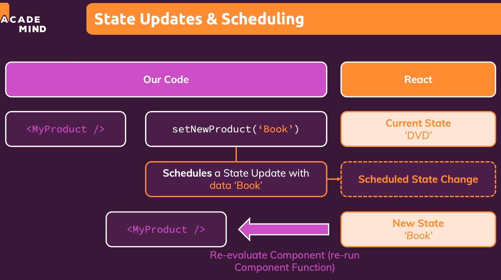

# 160. State scheduling and batching
Created Monday 11 July 2022

### Why
- React batches state changes.
- React can postpone state changes, in theory. This is done if there's some pending computation of higher priority.

### How
- State changes are batched in order, for a given state. And yes, multiple state changes can be batched for the same state.
- If there are multiple state updates, but for different states, i.e. if state change calls are close together (i.e. in a synchronous chain), then they are batched, and only *one* re-evaluation takes place.
  ```jsx
	const handler = () => {
			setText('Hello');
			// state is not updated here
			setAge(24);
		};
	```
	```jsx
	// even this, somewhat convulted example, works, React is smart in batching state changes
	const handler = () => {
		(() => setText('Hello'))();
			// state is not updated here
		(() => setAge(24))();
	}
	```
- The component is re-evaluated (and re-rendered) only after the all state changes have been processed.
  
- Use a callback in the state mutation function, if the state to be set depends on the previous state. Do this because the latest state from the batch is available as the param. Example:
	```jsx
	const [count, setCount] = useState(0);

	setCount(count + 1); // unsafe, not good
	setCount(prevCount => prevCount + 1); // safe and better
	```
	Why do this? Because it could be the case that multiple state changes were batched and not all processed (i.e. re-evaluation has not taken place), so the state accessed is actually the one of the last component evaluation.

### What
- State change batching is practically unobservable (because React is fast).
- The only issue can be the dependence of new state on the last change, which can be taken care of by using the callback version of the state mutation function (provided by `useState`).
- Inside `useEffect`, it is safe to use normal state update, even if depends on the previous state because `useEffect`'s code runs after the re-render, ensuring that all batched changes have finished processing.
- State batching/processing is not something to worry about, generally.
