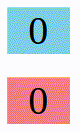

# 188. Creating Custom React Hook
Created Saturday 23 July 2022

### Situation
Create this. 

Both counters start from 0, one increments and the other decrements, every 1 second.

There are 2 known ways to do this:
1. Create two separate components - this will contain the most duplication
2. Have an higher order component, that takes in counter (i.e. the state) updation logic as prop. Code:
	```jsx
	import { useState, useEffect } from 'react';

	function EverySecondCounter(props) {
		const [count, setCounter] = useState(0);

		useEffect(() => {
			const timer = setTimeout(() => setCounter(props.updateCounter);

			return () => clearTimeout(timer);
		});

		return <div>{counter}</div>;
	}

	function App() {
		return <>
			<EverySecondCounter updateCounter={(prevState) => prevState + 1} />
			<br />
			<EverySecondCounter updateCounter={(prevState) => prevState - 1} />
			</>;
	}
	```

It is also possible, that different components have similar parts, and neither of these approaches will help.


### How
- Hooks are functions that can have state and use React hooks. There's no special syntax to create them, apart from naming it properly (i.e. `use` prefix).

##### Creation
- Custom hooks creation follow some conventions and rules:
	1. Every custom hook should be kept in it's own `.js` file.
	2. File name can be anything. Reason: a hook is not a component, so no PascalCase needed./
	3. Every custom hook name must start with `use`, this is important for 2 reasons:
		1. Helps indicate that the function is a hook.
		2. Helps with code intellisense in most IDE/editors.
		Note: not using a prefix `use` won't affect functionality. It's just a recommendation.
- A hook can accept parameters, as it's a function.
- Custom hooks may or may not have return values. 
- It is important to note that a state variable returned from a hook can act as the latest state. Every re-render will update the variable, without re-initializing the state (in the hook). *It just works*. Example:
	```jsx
	import {useState, useEffect} from 'react';
	
	function useCounter() {
		const [count, setCount] = useState(0);
		
		useEffect(() => {
			const timer = setTimeout(() => setCount(prevCount => prevCount + 1)
			, 1000);

			() => clearTimeout(timer);
		});
		
		return count; // returning the state
	}
	
	function App() {
		const incrementiveCount = useCounter(); // state is updated on each re-render
		
		return <div>{incrementiveCount}</div>;
	}
	```
##### Use
- To use a custom hook, import and use it like any other React hook.
  
##### Behavior of hooks
1. Each use of hook has it's own state, that is coupled with the component/hook it's being used in.
2. The place where a custom hook is used(i.e. called) can be visualized as if the custom hook code was directly placed there. Functionally, this is how custom hooks behave. In short, *the hook gets attached to the component where it is being used*. FIXME: how are custom hooks implemented.
   
### What
See the code, [here](https://github.com/exemplar-codes/assorted-reactjs-apps/blob/f86d9b6343e848100cf6ef8ad53b01fde49c5762/src/Apps/CustomHookDemoCounter/CustomHookDemoCounter.jsx).