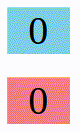

# 188. Creating Custom React Hook
Created Tuesday 23 July 2022

Goal: Create this. 

Both counters start from 0, one increments and the other decrements, every 1 second.

There are 2 known ways to do this:
1. Create two separate components - this will contain the most duplication
2. Have an higher order component, that takes in counter (i.e. the state) updation logic as prop. Code:
	```jsx
	import { useState, useEffect } from 'react';

	function EverySecondCounter(props) {
		const [count, setCounter] = useState(0);

		useEffect(() => {
			const timer = setTimeout(() => setCounter(props.updateCounter);

			return () => clearTimeout(timer);
		});

		return <div>{counter}</div>;
	}

	function App() {
		return <>
			<EverySecondCounter updateCounter={(prevState) => prevState + 1} />
			<br />
			<EverySecondCounter updateCounter={(prevState) => prevState - 1} />
			</>;
	}
	```

It is also possible, that different components have similar parts, and neither of these approaches will help.

- Every hook is kept in it's own `.js` file.
- File name can be anything. Reason: a hook is not a component.
- Every custom hook should also start with `use`, this is technically important for React.
- Add non UI code in the custom hook function.
  

- The hook gets attached to the component where it is being used.
- Each use of hook has it's own state, as is obvious.
- We can return a read-only value from the hook.
- A hook can accept parameters, as it's a function.
  
See the code, [here](https://github.com/exemplar-codes/assorted-reactjs-apps/blob/f86d9b6343e848100cf6ef8ad53b01fde49c5762/src/Apps/CustomHookDemoCounter/CustomHookDemoCounter.jsx).