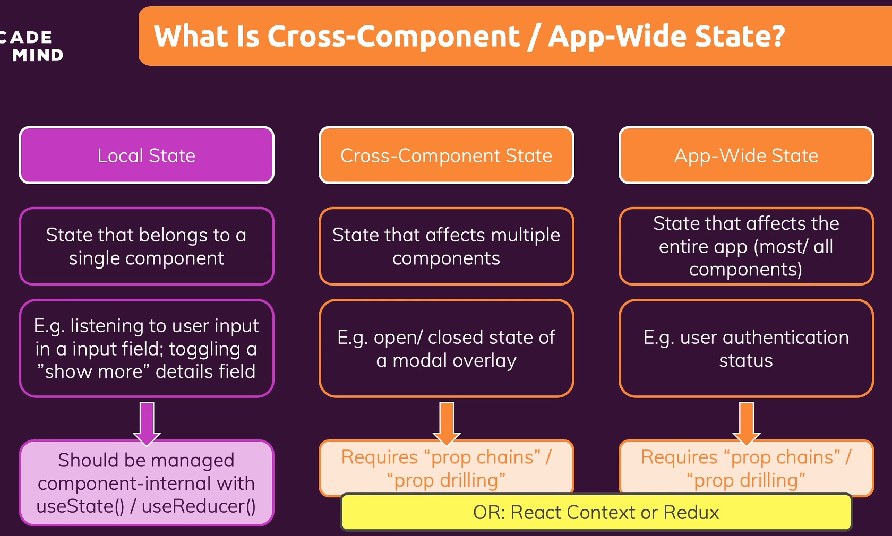

# 227. Another look at state in React apps
Created Wednesday 27 July 2022

##### What is Redux?
Redux is a state management system for *cross-component* or *app-wide* state.

##### What is Cross-Component/App-Wide state?
- State refers to variables/data in the app which changes and correspondingly, leads to a change in the UI being rendered.
- State in GUI apps can be classified into 3 types:
	1. Local state - state that belongs to a single component. Implemented using `useState` and `useReducer`. Example: entered input for an `input` tag.
	2. Component-wide state - state used by multiple components of the app. Implemented by state being passed to other components by prop-drilling or `useContext`. Example: modal open/closed state.
	3. App-wide state - state that affects most/all components of the app. Implementation is the same as component-wide state.

