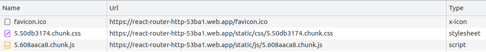

# 298. Exploring routing issues and finishing deployment
Created Sunday 30 October 2022

## Situation
Let's consider a typical visit to our website (that uses client side routing) by a user:
- Assume the first request URL is `/` (i.e. your domain, without any path specified). Our static hosting server will provide the bundle files - HTML, CSS, JS and assets. If we are using lazy loading, the server provides the home page bundle.
- The website loads successfully.
- The user clicks on a button that routes them to, say `/path1`. Because we are using `React Router`, it detects the URL change, and renders (directly or by downloading lazy entities) the corresponding view.
- OK, works fine.

But what if the user directly enters a path in the URL bar? The server will receive a request for `/path1`, consequently, it will try to find a file named `path1.html`, which is actually absent since our website is a single page app, and we only have one shell (i.e. `/` - `index.html`).

The server will respond with a 404 error.

This is not good.

We should be able to load pages directly by path entered by the user as well.

The problem isn't with `react-router` or any app code, it's with the server code. 

Solution - configure the server to ignore all request URL paths and treat them as `/`.

This time, when the user runs requests `/path1`, the server receives a request with URL `/path1`, but it ignores it and sends back website code for `/`, which it successfully can. The browser receives the code, but `/path1` URL is persisted in the browser. When the JavaScript code runs, `react-router` notices `/path1` and renders the corresponding view. Success.

## Why
Servers, by default, treat URL paths as location for files. This can be an issue for an SPA using client side routing. Because SPAs don't actually have files for different pages.

This can result in 404 errors. Thus, one needs to configure hosting servers for SPA to ignore paths.

## How
The simplest way, is to have server side code with a single route defined - `/*` for the bundle code.

## What
Most static site ask or have an option to specify if the app is an SPA.

## Question - lazy loading
Q: If the server responds to only one end point, how does one request for component that needs to be lazy loaded?
A: Firebase seems to work apps that use lazy loading, after hosting as SPA code. And most other services do too. 

My guess, it's something like this. The server side code actually has 2 _types_ of routes:
- "page" routes - there's only 1 for SPAs - (`/(?!assets).*` - returns the app bundle files, or the "main" bundle files if app uses lazy loading)
- "asset" routes - can be multiple for SPA or MPA - `/assets/:asset_name` - returns requested assets like CSS, JS, images, audio, text.

When a user makes a path request, it's mostly of the "page" type, so they get the main bundle, `react-router` kicks in and makes "asset" requests for the lazy entities, and they are fetched.

See (Browser DevTool > Network tab screenshot):
- Initial load 
- Lazy loaded page 