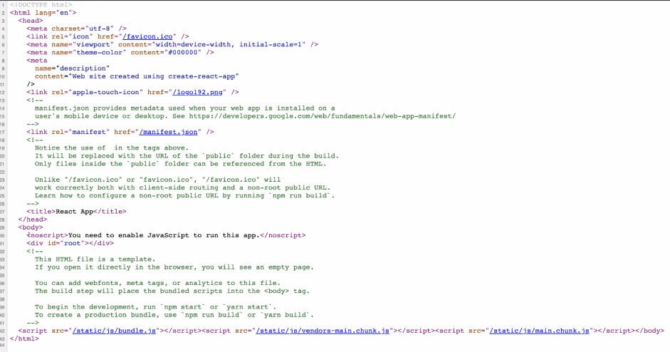
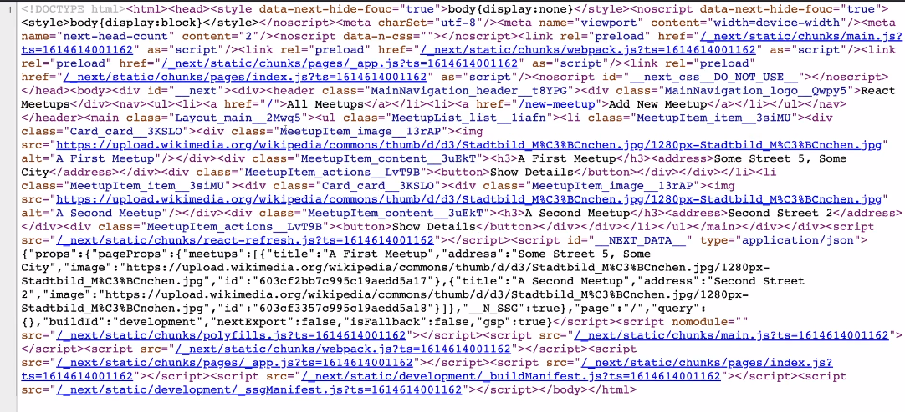

# 318. 1st key feature: SSR
Created Tuesday 6 December 2022

The most important feature of Next.js: Server-side rendering (SSR) - helps with SEO and first-load performance.

## Why
In an pure SPA, an empty shell (something like `<div id="root" />`) is sent as the HTML on first load. When the JavaScript finished downloading, it builds up the markup dynamically and styles are also applied. This has two major drawbacks:
1. **Search Engine Optimization/Discovery** - almost all search engines can primarily only recognize static HTML documents and crawl using the links present in them. As the SPA is an empty shell, i.e. no discoverable or crawlable content, it is ignored by search engines. This is a serious issue for public web apps, since finding things and customer traffic are important.
2. **First contentful load (wait time is long)** - since SPA's are mostly empty markup that are built dynamically by JavaScript, it can hinder first load. There are two aspects to it:
	1. **Downloading large bundle of SPA** - since SPA's want to minimize content requests to the server, the whole app, generally (assuming minimum code splittling), is bundled into a single file, which it too big. This means the first load will take a relatively long time, which is very bad a UX and users will simply exit the app.
	2. **Late first data request** - even if a bundle is small and the SPA loads fast, "data" still has to be fetched from the server. This "fetch" request will only be run *after* the SPA has loaded properly. So total time = HTML/CSS download + bundle download + "data" fetch. Whereas a static site would just have HTML/CSS/vanillaJS download.

*Pure SPA first page*



## How
All these issues are solved using a technique called server-side rendering (SSR). The key is to send a full markup page imbued with data instead of an empty SPA shell. All issues are solved:
1. SEO - bots get the complete markup they want.
2. Native load times - the browser gets a full page (with data) on first request. In the meantime, the SPA bundle download finishes. All subsequent interactions happen exactly like a pure SPA, which we want of course, coz no reloads/latency (the original reason for making an SPA).

*SSR first page*


**Catch**: Of course, we need to generate the first page at run-time on the server, in other words a static-server/CDN is not enough at all. We can solve this partially by pre-rendering pages and caching them on a CDN using some smart heuristic/strategy, atleast for fast changing public pages.

**Should all apps use SSR**: SSR is good. But it is *not very useful* for:
1. Private pages, assuming SEO is the major goal. 
2. High frequency app, say a B2B/non-public dashboard where speed (think pre-rendering) doesn't matter.
3. For small apps which have a lot of private pages, don't need SEO and pre-rendering won't be noticeable.

**Assumptions**
1. Sending pre-rendered "first" pages is fast - i.e. server (Node.js in case of Next) can quickly build markup (at request time), comparable or much faster than a layout engine does in a client browser.
2. Our first data requests (data to be imbued into markup) are fast enough from a backend performance perspective. e.g. if the server itself has to make many requests externally, then the point of SSR is set moot. This could be solved by incrementally pre-rendering most requested pages (or some other heuristic), this is called ISR (incremental server rendering).


## What
We make components just like in any SPA, since the app will behave exactly like a usual SPA.

Essentially, the only difference is that on first page request, we *mock* "requests" that a SPA would make on the client, directly (FIXME: lame headless browser?) on the server. This gives us both the markup (for search bots) and initial data (fast first contentful load).

Because the SSR process is for first load only, and essentially optional, an app written in Next.js (or any SSR app) can still be deployed with almost no changes using a static-server/CDN. SEO and first load won't be good, but it's certainly better than nothing. In other words, an SSR app falls back to behaving like a pure SPA if it's kept on a static server.

The code is very simple:
```
export const Component = ...; // makes request and all

export requestMocker = ...; // get data from database and mock them as response
```
The SSR runtime will run the request page's component in context of the `requestMocker` to generate markup. If we are running in SPA mode (i.e. on a static server), this simply does not take place.