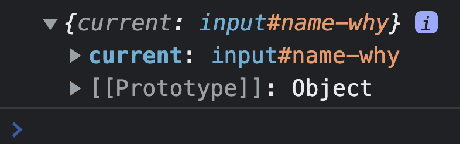

# 106. Refs
Created Friday 4 March 2022
- [ ] in vault

### Why
- Refs (short for references) is a way to access DOM nodes directly in React. It is used to read, and rarely, write to DOM nodes. It is especially useful in forms where we need to read `input` elements for values on submission.
- Usage 2: have state independent of re-renders.

### How
There are 3 parts to the code:
1. Declare the ref variable.
2. Tag the ref variable to the HTML element being monitored (being "referenced" 👀).
3. Write code that reads, writes to using the ref. Note, this should be outside of any JSX. WHY? FIXME.

- The ref variable has a property called `current` whose value is an object with name-values being element attributes (including `value` for `input`s). In short all attributes are present in `refVariable.current`.

- The ref variable can be read/written from/into, and this will reflect in the component on the page.

Here's an example with the 3 code parts:
```jsx
import React, { useRef } from 'react';

function MyComponent {
  const refVariable = useRef(); // 1 - no argument passed

  const onSubmitHandler = () => {
    event.preventDefault();
    // 3 - reading/writing from/to the refVariable, and hence to the DOM

	getFromRocket(refVariable.current.value);

	refVariable.current.value = ''; // clearing the input
  }

return (<div>
		  ...
		  <form>
		    <input ... ref={refVariable} /> <!-- 2 - HTML element tagged-->
			...
			</form>
			...
        </div>);
};

export default MyComponent;
```
- [Need and derivation](https://github.com/exemplar-codes/react-hello-world/tree/5a83a92598ad832fb882a43ede103946b9815458/src/Apps/UseRefDemo) of the `useRef` hook.

### What
- Note that using `useRef` does not re-render the page, unlike `useState` which does re-render.
- The lifetime of the `useRef` variable is the same as the component's lifetime.
- Although, the `useRef` variable can be used mutate the DOM, this must be avoided as much as possible (WHY? FIXME). Clearing `input` value is OK though, as we are not creating/deleting DOM nodes.


#### Where are refs used ?
- refs are very handy for forms or for reading stuff from the DOM.
- refs have helped in eliminating state based input reading mechanisms that would change on every keystroke (using `onChange`). Using `useState` is also OK, but `useRef` is better suited here.
