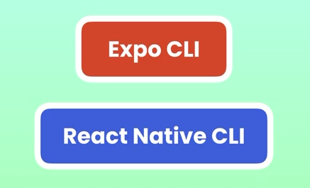

# 4. Expo
Created Tue Nov 7, 2023 at 9:37 AM

- Expo is a framework built on top of React Native. It provides axtra components and other utilities generally missing from React (since it's a library)
- Expo is beginner friendly, and most problems of RNCLI (due to setup mistakes or otherwise) are taken care of, in Expo.

- The alternative to expo is React Native CLI, which is the default way to start and build apps in React Native
- One disadvantage of Expo is that you cannot use native code (Java/Kotlin/Swift) in the code. Only Javascript is allowed. RNCLI on the other hand, allows native code additions if you need it.
- Project structure of Expo is simpler, since it doesn't have support (or folders) for native code.

We'll use Expo here. The project structure is simpler in Expo apps.

