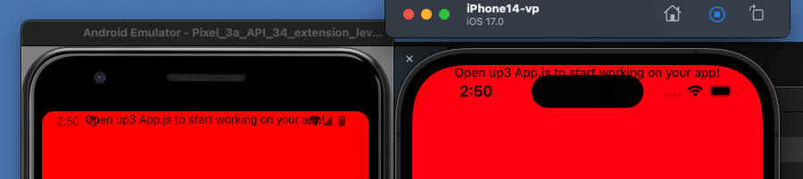
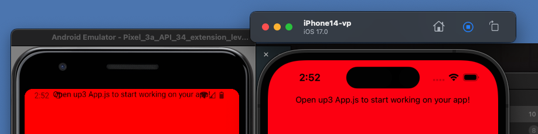
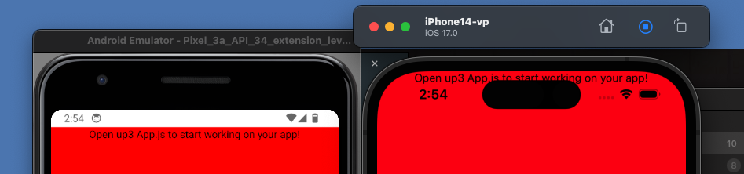
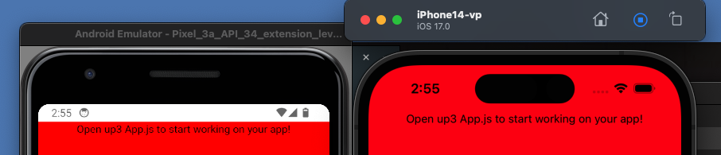

# 9. Platform
Created Wed Nov 15, 2023 at 1:19 AM

- Used for getting platform value at runtime
- Used when: suppose a font isn't available on Android, then a ternary with a fallback font would help.

```jsx
import { Platform } from 'react-native';

const isAndroid = Platform.ios === 'android';
```

- Possible values are `'ios'`, `'android'`, `'windows'`, `'web'`

---

## Fixing app using `StatusBar` API
Consider the following code:
```jsx
import { View, Text } from "react-native";

export default function App() {
  return (
    <View
      style={{
        flex: 1,
        backgroundColor: "#f00",
        alignItems: "center",
      }}
    >
      <Text>Open up3 App.js to start working on your app!</Text>
    </View>
  );
}
```

The default behavior of RN apps is that they try to take up the whole screen space, including System UI. This is understandable since an app can work in fullscreen mode.

The code renders like this (Android on left, iOS on right).
There's no top bar safety/margin (both overflow to top bar)


After using SafeAreaView (Android no change, iOS notch avoided):


After using only padding (no SafeAreaView) `StatusBar.currentHeight`
Android fixed, iOS broken:


With SafeAreaView and conditional Android margin of `StatusBar.currentHeight`. Both fixed:


Final code:
```jsx
import { StatusBar, Text, Platform, SafeAreaView } from "react-native";

export default function App() {
  return (
    <SafeAreaView
      style={{
        flex: 1,
        marginTop: Platform.OS === "android" ? StatusBar.currentHeight : 0,
        backgroundColor: "#f00",
        alignItems: "center",
      }}
    >
      <Text>Open up3 App.js to start working on your app!</Text>
    </SafeAreaView>
  );
}
```