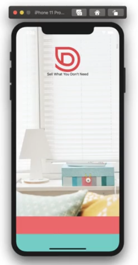
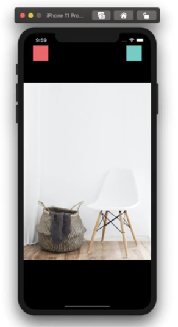

# 10. Exercises
Created Thu Nov 16, 2023 at 2:15 AM

## Tip - create a `app`/`src` folder
- After initializing the project code with Expo.
	- Make an `src` or `app` folder and move important code there. This will be helpful if we eject from expo, create a new project with copied code, or move to a different tooling for RN. 
	- Update `app.json` paths for moved files.
	- Move `/assets` into `src`
- General structure of `src`
	- `assets`
	- `screens` (aka 'pages' in web)
	- `components`

## Exercise 1 - WelcomeScreen

Lessons
- Work with images, esp in the background
- `width`/`height` for fixing dimensions as opposed to `basis`/`grow`/`shrink`

[Code](https://github.com/exemplar-codes/DoneWithIt/commit/3219f8765c06e53c7a6964487a74b236205373a5)

## Exercise 2 - ViewImageScreen
Lessons:
- Prevent app UI overflow into system
- Fixing image sizes (esp big to small) - `<Image resizeMethod="scale" />`

[Code](https://github.com/exemplar-codes/DoneWithIt/commit/c1cba8525377f03ccc8144c694f30199bdfad76f)