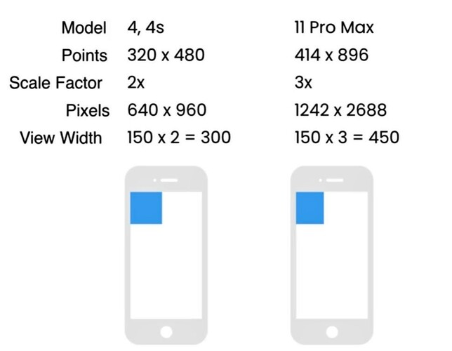

# 2. Dimensions
Created Wed Nov 15, 2023 at 3:08 AM

## Size units in RN
1.  dp (density independent pixels) - `15`, number.
2. Pixel - `'15px'`, string.
3. Percentage (of parent) - `'50%'`, string.

## Prefer dp for fixes sizes
(FIXME: why?)

## `Dimensions` API
- Used to get dimensions of the screen.
-  There are two args - `'screen'`(whole device) or `'window'` (space used by app).
- on iOS, both screen/window return are the same value.
- Con: the values don't update when device orientation is changed. They do change if the component re-renders.
```jsx
import { Dimensions } from "react-native";

export default function App() {
  console.log(Dimensions.get("window"));
  // { "fontScale": 1, "height": 780, "scale": 2.75, "width": 392.7  }

  console.log(Dimensions.get("screen"));
  // { "fontScale": 1, "height": 808, "scale": 2.75, "width": 392.7 }

  return null;
}
```