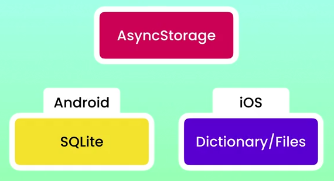

# 5. AsyncStorage
Created Sat Dec 30, 2023 at 1:55 PM

[AsyncStorage](https://www.npmjs.com/package/@react-native-async-storage/async-storage) was a part of RN core once, but was deprecated.
It's now a standalone community maintained library.

It can be installed and used in Expo, or RNCLI. No extra steps needed.

## Inspecting AsyncStorage
- Run the function `showAsyncStorageInDev` in the react-native-debugger console.
- Run `$reactNative.AsyncStorage.clear()` to clear stored values

## AsyncStorage internals
Internally, AsyncStorage is implemented like differently on Android and iOS.
The library interface is the same for us, of course.
