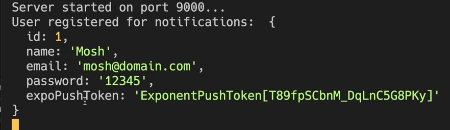

# 4. Getting push notification token
Created Sat Dec 30, 2023 at 1:56 PM

The following is just *pseudocode* for the flow (described on previous page). Here's the [actual](https://github.com/exemplar-codes/DoneWithIt/commit/c450f48ff09288f11f6e192b3f75eddb4838ee86) code.

Each token corresponds to an "app installation". So both device+app are registered in one go. Also, we need to do this once per install.
## Client code
This is for hint, for actual steps see next page.
```js
// client flow
// assuming user is logged in.
// sync permissions have also been handled.

import callExpoToGetNewToken 'some-expo-package';

useEffect(() => {
  const backendHasTokenForDevice = await callOwnBackend();
  if(!backendHasTokenForDevice) {
    const tokenFromExpo = await callExpoToGetNewToken({ appId: 'from-eas.json' }); // client - Expo talk directly.
    // this `direct` talk is important. Because otherwise we'd need to get platform info
    // and send to Expo from backend. Not hard, but why deal with platform info at all?
    
    await sendTokenToOwnBackend(tokenFromExpo);
  }
}, [])
```


## Server code
```js
// backend flow
// assuming user is in database, and notification token is saved too.

import SomeNotificationSDK from 'some-notification-sdk';

const user = await dbGetUser(id);
SomeNotificationSDK('The message', user.notificationToken);
```

Sent from app to our server, below. Save token into the DB now, in the user row/object.
