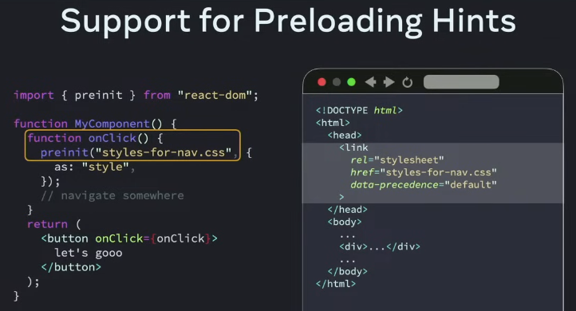

# Day 1
Created Fri May 31, 2024 at 10:57 AM

## Keynote info


Agenda
1. State of React
2. React 19
3. What's Next
## Long term goal of React
User Experience (UX)
• Fast startup
• Responsive interactions
• Delightful extras and polish

Developer Experience (DX)
• Low barrier to entry
• High productivity
• Ability to scale

> Whether you're a first-time developer like I was back in Japan or an experienced engineer whether you're backend engineer machine learning expert just trying to quickly get something up to show your colleagues.

> Whether you're working alone or in a giant organization or anywhere in between.

> This requires focusing on the developer experience again it's always been possible to build something great but it's usually so much work that we just focus on the basics and move on to the next task.

>  So we want to lower the barrier to entry not just for basic features but for sophisticated UI to help you build something amazing in the time you have.


## State of React
- There are many libraries that cover the important aspects of an app.
	
- But choosing libraries can be a lot work. So it's recommended to choose a meta framework. React Frameworks handle many foundational features of an application for you while still giving you a lot of flexibility in choosing additional libraries.
  

## React 19
> Ul challenges stem from non-local coordination and scale.
> 
> For example synchronizing application state with our UI is a giant coordination problem, since there's an exponential number of State transitions to consider.
> 
> The solution is: expose declarative APIs, viz Components and JSX, so you specify the UI declaratively, and the React handles the complex coordination on your behalf.


e.g. for loading states, React Suspense is a declarative API to choose/specify loading states, and handles all the coordination for us.


- Server Rendering & Suspense
- Hydration
- Actions
- JSX Improvements

React allows writing composable HTML, but only for visual tags. What about:
- Metadata
- Stylesheets
- Scripts
- Loading hints

### Metadata and Stylesheets
Suppose we have a nested component like so,
```jsx
function Article() {

  return (
    <>
      <title>Story Time!</title>
      <link rel="stylesheet" href="..." />
      <article className="i-look-like-an-article">
        Let me tell you a story... ba dum cha!
      </article>
    </>
  );
}
```
The tags will not be where they *should ideally be* (if hand written).  Therefore, this will not be picked up by robots since `title` needs to be in the HEAD tag of HTML, and the stylesheet won't be loaded until browser render engine reaches this level of nesting.

Possible solutions
- Well, we could use an effect or portal to directly add them at the correct place. But this is even worse, since the SEO crawlers will see nothing (since code is in transit, and has not run for the effect or portaling to have started). ❌
- Split components by location. Well that's a decision pain to make. ❌

Current solution:
1. meta tags are picked and moved up during server or client render.
2. `<link />` stylesheets can be given a "precedence" attribute of 'default', 'high' and 'low', and react moves them to top of HTML sorted by the value. Essentially "Suspense for CSS"


### Scripts
- React 19 adds support for hoisting and async scripts.


### Preloading hints




### React Actions
Andrew Clark.


### Ref is now a passable prop


### React 19 Beta -> RC
- [ ] Libs and framework author feedback for React 19 has been good. So it's now an RC.


## Performance - React compiler
### React Compiler


There's no need to change our code, the compilation happens automatically.
FB has been using Compiler since 2023, on Instagram website and Quest (VR) apps. Results:


- Without the compiler, some FB components needed ~20 `useMemo` with significantly large dependency arrays.
- The compiler finds even more optimizations. And we can delete the manual optimizations.


Try the React Compiler in React 19
```sh
npm i babel-plugin-react-compiler --save-exact
npm i estint-plugin-react-compiler --save-exact
```

Note: the compiler is still experimental, and there may be bugs.
### dd

### React 19 RSC


### Async actions and transition API
https://github.com/sanjar-notes/react/issues/73 solves simple but important coordination problems

