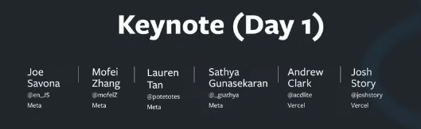
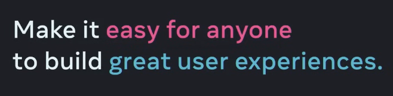

# Day 1
Created Fri May 31, 2024 at 10:57 AM

## Keynote info

Agenda
1. State of React
2. React 19
3. What's Next
## Long term goal of React
User Experience (UX)
• Fast startup
• Responsive interactions
• Delightful extras and polish

Developer Experience (DX)
• Low barrier to entry
• High productivity
• Ability to scale

> Whether you're a first-time developer like I was back in Japan or an experienced engineer whether you're backend engineer machine learning expert just trying to quickly get something up to show your colleagues.

> Whether you're working alone or in a giant organization or anywhere in between.

> This requires focusing on the developer experience again it's always been possible to build something great but it's usually so much work that we just focus on the basics and move on to the next task.

>  So we want to lower the barrier to entry not just for basic features but for sophisticated UI to help you build something amazing in the time you have.

