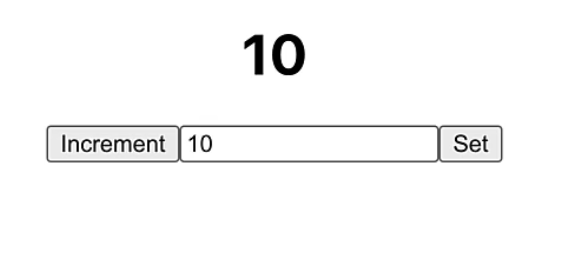
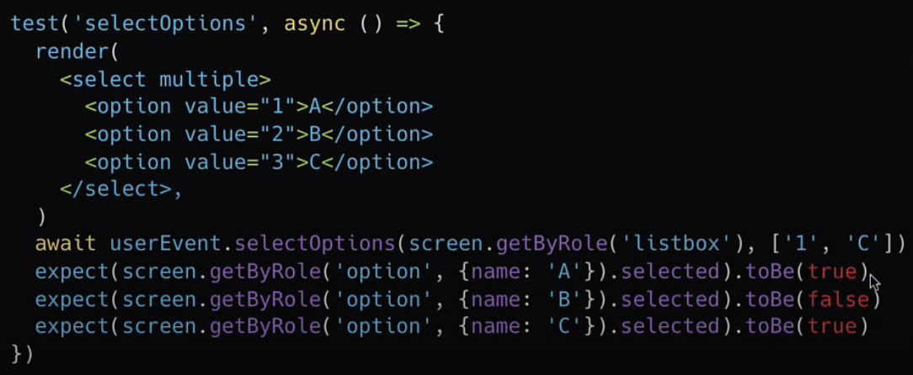
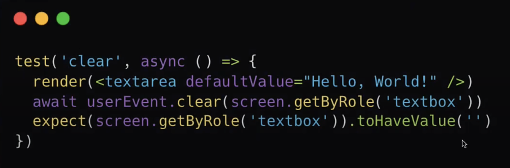
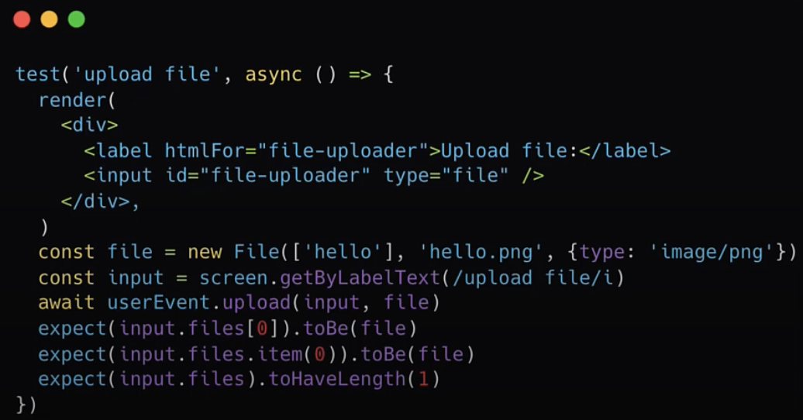

# 37. Keyboard Interactions
Created Mon Sep 30, 2024 at 4:11 PM

## Example

```jsx
import { render } from "@testing-library/react";
import { user } from "@testing-library/user-event";

test("renders a count of 10 after clicking set button", () => {
	user.setup();
	render(<Counter />);

	const amountInput = screen.getByRole("spinbutton");
	await user.type(amountInput, "10");
	expect(amountInput).toHaveValue(10);
	
	const setButton = screen.getByRole("button", { name: "Set" });
	await user.click(setButton);
	
	const countElement = screen.getByRole("heading");
	expect(countElement).toHaveTextContent("10");
});

test("elements are focused in the right order", () => {
	user.setup();
	render(<Counter />);

	const amountInput = screen.getByRole("spinbutton");
	const setButton = screen.getByRole("button", { name: "Set" });
	const incrementButton = screen.getByRole("button", { name: "Increment" });

	await user.tab(); expect(incrementButton).toHaveFocus();
	await user.tab(); expect(amountInput).toHaveFocus();
	await user.tab(); expect(setButton).toHaveFocus();
});
```

## APIs
- `type(element, text)` - utility API
- `tab()` - convenience API
- `clear(element)`
- `selectOptions(elements, optionsArray)`. optionsArray value is polymorphic. Works for single as well as multi-select boxes.
- `deselectOptions`
- `upload()` - file upload sim

Note:
```jsx
interaction(element=[null], value=undefined)

// so all these are valid
user.interaction(); // valid
user.interaction(myElement); // valid
user.interaction(myElement, "value"); // valid
```





## Clipboard APIs
Not available out of secure contexts.
- `copy(element)`
- `cut(element)`
- `paste(element)`

## Keyboard APIs
allows to simulate interactions with a keyboard
- `user.keyboard('foo')` - does typing f, o, o
- `user.keyboard('{Shift>}A{/Shift}')` - does Shift + A shortcut
- `user.keyboard('{{a[[')` - does `{`, `a`, `[`. Double for escape.
- `user.keyboard('{a>5}')` - press a without releasing it and trigger 5 keydown (repeated 5)

Note:
- `{}` - is for keyboard keys
- `[]` - is for mouse keys

## Misc
- Delay between keystrokes - https://testing-library.com/docs/user-event/options#delay