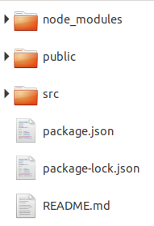
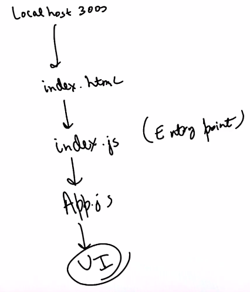

# 1. Folder structure
Created Thursday 27 August 2020

Files/Folder in order of importance(descending):

1. ``node_modules`` folder - node dependencies, ignored in ``.gitignore``.
2. ``public`` folder - Has ``index.html`` (the app is rendered in a div here, ``id=root``).
3. ``src`` folder - *all code* should be added here. 
	1. Has ``index.js`` - The main/homepage injector to ``index.html``.
4. ``package.json`` - node dependency file.

*****

How the files work together:

* We can make folders and place things in them, only except index.js.

