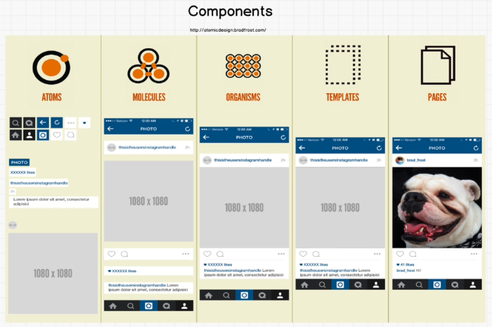

# 4. React Components
Created Wednesday 29 July 2020

#### Why
Components are universally useful in building UIs, because the enhance:
* Seperation Of Concerns
* Reusability

#### How
* HTML, CSS and JavaScript are combined to create components, using the React library.
* They are also combined using the React library.

So this is a 2 step process - create units and then combine them.

#### What
* React is all about components.

* All component names should start with a capital letter(very important - CamelCase) - React generally treats lowercase elements as standard HTML elements.
* Every component exports a class or a function that returns **one and only one** wrapped JSX element(like a div or React.Fragment tag-for multiple components).
* Styles should be named as a component-class because all CSS is finally bundled in the head tag.
* The index.js renders all the components, finally, and only it should, generally. 

It's normal to have ~100 components for a UI, because components of the UI are broken down.

