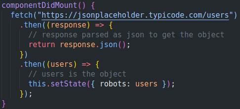
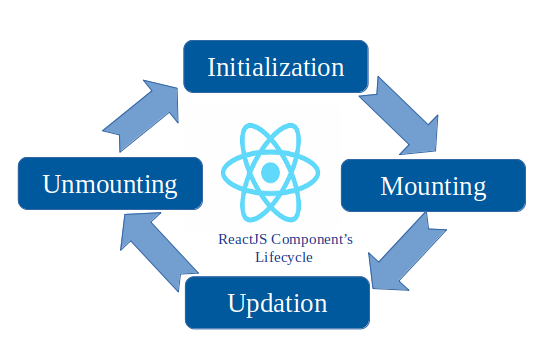
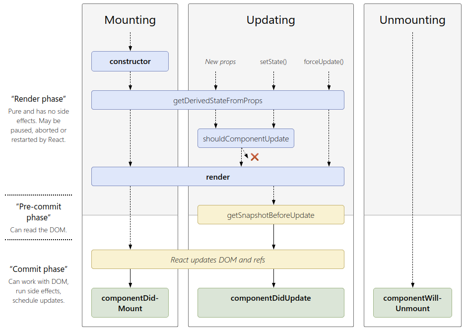
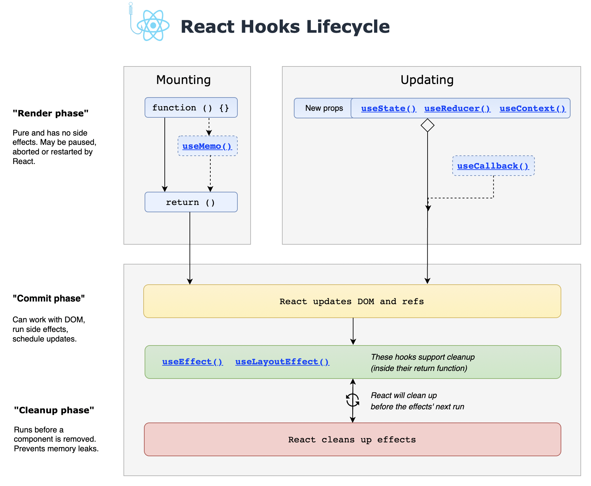

# 1. React lifecycle hooks
Created Tuesday 08 September 2020

* There are some inbuilt functions in React that are great.
* There are only 8 of them.
* We'll be looking at one called **componentDidMount**

This function checks if the component has already mounted, and runs if it has mounted. This of great use when we want to trigger data calls to our database. In the *robofriends*, we use this function to update the robots array using the URL.

**Syntax**: This function is to implemented in a class component as a member function.

*****

i.e [Lifecycle of a component](https://projects.wojtekmaj.pl/react-lifecycle-methods-diagram/) - as of Sept 2020

* the **componentDidUpdate** has two params, componentDidUpdate(prevProps, prevState)

Functional component lifecycle hooks: https://wavez.github.io/react-hooks-lifecycle/

