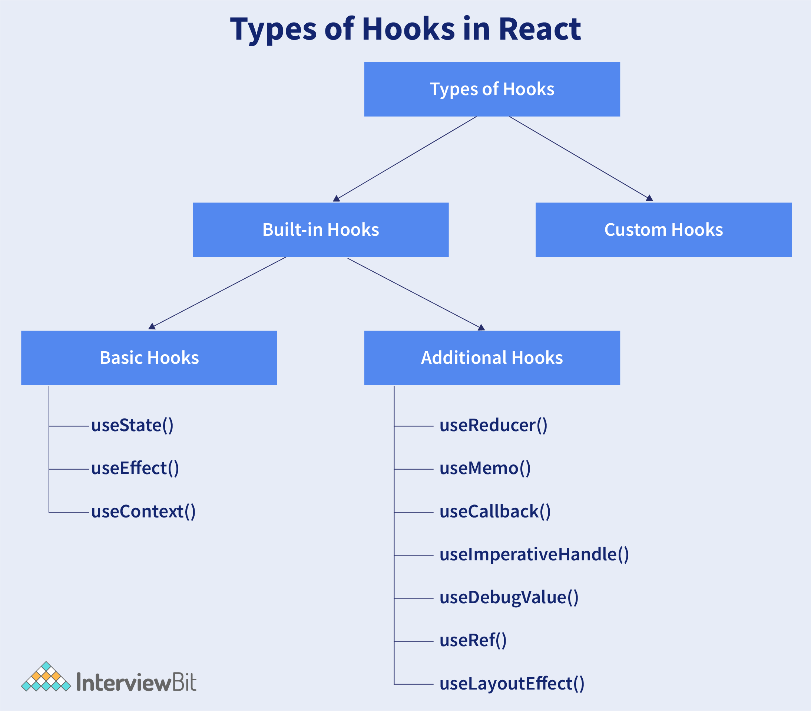

# 2.1. Why React hooks
Created Tuesday 08 September 2020

FIXME: read and explain
1. Need of hooks
2. What are hooks - Hooks are functions that let us “hook into” React state and lifecycle features from a **functional component**.
3. https://reactjs.org/docs/hooks-intro.html#motivation
4. W2H of Custom hooks
---
5. Add other hooks of react along with this info:
There are two types of Hooks in React. They are:
1. Built-in Hooks: The built-in Hooks are divided into 2 parts as given below:

## Basic Hooks
- `useState()`: This functional component is used to set and retrieve the state.
- `useEffect()`: It enables for performing the side effects in the functional components.
- `useContext()`: It is used for creating common data that is to be accessed by the components hierarchy without having to pass the props down to each level.

### Additional Hooks
- `useReducer()` : It is used when there is a complex state logic that is having several sub-values or when the upcoming state is dependent on the previous state. It will also enable you to optimization of component performance that will trigger deeper updates as it is permitted to pass the dispatch down instead of callbacks.
- `useMemo()` : This will be used for recomputing the memoized value when there is a change in one of the dependencies. This optimization will help for avoiding expensive calculations on each render.
- `useCallback()` : This is useful while passing callbacks into the optimized child components and depends on the equality of reference for the prevention of unneeded renders.
- `useImperativeHandle()`:  It will enable modifying the instance that will be passed with the ref object.
- `useDebugValue()`: It is used for displaying a label for custom hooks in React DevTools.
- `useRef()` : It will permit creating a reference to the DOM element directly within the functional component.
- `useLayoutEffect()`: It is used for the reading layout from the DOM and re-rendering synchronously.

All hooks listed below:

## Custom Hooks
A custom Hook is basically a function of JavaScript. The Custom Hook working is similar to a regular function. The “use” at the beginning of the Custom Hook Name is required for React to understand that this is a custom Hook and also it will describe that this specific function follows the rules of Hooks. Moreover, developing custom Hooks will enable you for extracting component logic from within reusable functions.

## Questions about hooks
1. How does the performance of using Hooks will differ in comparison with the classes?
   - React Hooks will avoid a lot of overheads such as the instance creation, binding of events, etc., that are present with classes.
   - Hooks in React will result in smaller component trees since they will be avoiding the nesting that exists in HOCs (Higher Order Components) and will render props which result in less amount of work to be done by React.
2. Do Hooks cover all the functionalities provided by the classes? - Our goal is for Hooks to cover all the functionalities for classes at its earliest. There are no Hook equivalents for the following methods that are not introduced in Hooks yet:
	- `getSnapshotBeforeUpdate()`
	- `getDerivedStateFromError()`
	- `componentDidCatch()`
