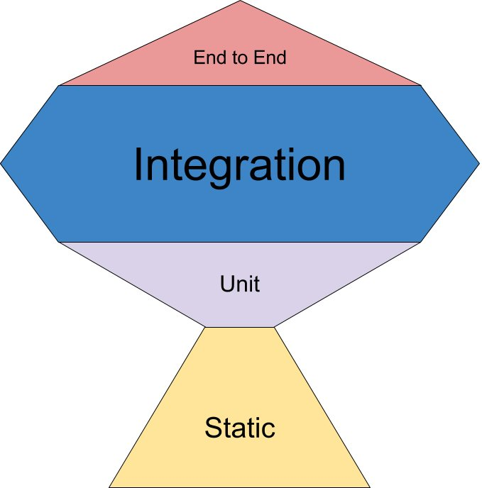

# 0. About UI Testing
Created Thu Sep 12, 2024 at 12:37 PM

## Components of a UI testing suite
1. Runner - structure tests in nested blocks, run them. Example: [Vitest](https://vitest.dev/)
	- Coverage - Build charts and track how much of the code is covered by the tests.
	- Snapshots - capture the rendered output or the component's state at a specific moment in time, and store it as a "snapshot". Later tests compare the current output with the saved snapshot to detect unintended changes in the UI or logic. This helps ensure that the UI hasn't changed unexpectedly over time. Example: [Vitest](https://vitest.dev/)
2. Environment - a headless browser that emulates the DOM. [jsdom](https://github.com/jsdom/jsdom), [happy-dom](https://github.com/capricorn86/happy-dom)
3. Framework renderer - Renders framework (like React) code to DOM nodes. Example: [React Testing Library](https://testing-library.com/docs/react-testing-library/intro)
4. Matchers -  Query, assert helpers, comparators for output vs. ideal output, used to verify that the actual results match expected results. Additionally, assertion utils relevant to the domain.  [Vitest](https://vitest.dev/), [@testing-library/jest-dom](https://github.com/testing-library/jest-dom) (~~btw, already included in Vitest~~ have to use [this](https://github.com/testing-library/jest-dom/issues/567#issuecomment-1880205132) workaround).
5. Mocks - ability to mock functions, code, API calls. Useful since real calls can be expensive/inefficient. Also used to check various scenarios. Example: [MSW](https://mswjs.io/)

Vitest provides everything except a simulated environment and framework renderer. For these we use happy-dom and RTL respectively.

## Types of tests
- Static: error and type checks in the IDE
- Unit: React-Testing-Library
- Integration: Cypress
- E2E: Cypress

Here's the ROI of test - Testing pyramid

## Articles
- [Compare React testing libraries](https://blog.logrocket.com/compare-react-testing-libraries/#:~:text=to%20choose%20from-,Comparing%20React%20testing%20libraries,the%20results%20among%20libraries.,-Jest%20vs.%20Jasmine)
- https://kentcdodds.com/blog/testing-implementation-details
- https://kentcdodds.com/blog/the-testing-trophy-and-testing-classifications
- https://www.reddit.com/r/reactjs/comments/x68637/comment/in5zxsv/?utm_source=share&utm_medium=web3x&utm_name=web3xcss&utm_term=1&utm_content=share_button
- https://www.browserstack.com/guide/jest-vs-mocha-vs-jasmine